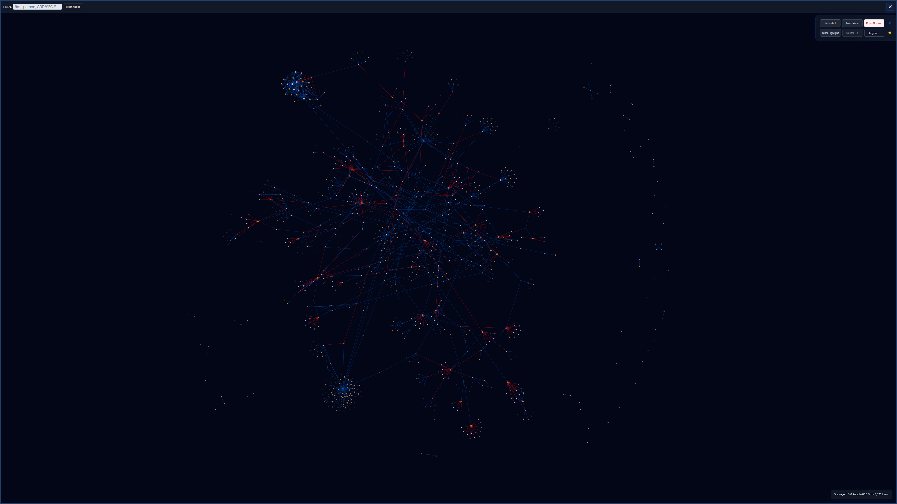

# FINRA Network Graph

An interactive FINRA / SEC relationship explorer built with **Next.js 15**, **React 19**, and **D3 v7**.

The app turns FINRA BrokerCheck and SEC AdviserInfo records into a navigable network of people, firms, and control relationships. You can search, expand the graph incrementally, inspect merged detail records, and keep your working session across reloads.

Live demo: https://finra-data-chart-next-02.vercel.app

---

## At a glance

- Explore relationships between brokers, advisers, firms, and control entities
- View FINRA BrokerCheck and SEC AdviserInfo detail in one place
- Expand the graph incrementally from searches, fetched records, and saved profiles
- Inspect rich sidebar detail with timelines, disclosures, and ownership context
- Run locally from cached artifacts or deploy with bundled graph and primed cache data
- Hydrate search, expand, and graph **firm names** from gzip search-index sidecars (`public/search-indexes/search-index.*.json.gz`) so nodes do not stay stuck as `Firm <CRD>`

See `docs/search-sidecar.md` for the sidecar hydration path.

---

## Preview & demo



- **Live app:** https://finra-data-chart-next-02.vercel.app
- **Best first click:** search a person, firm, or CRD, then open a node and explore the sidebar detail sections

---

## Why this exists

FINRA and SEC data is rich, but it is usually consumed one record at a time.

This project turns those record-by-record views into a navigable network so you can:

- spot clusters of related firms and people faster
- inspect ownership and control relationships alongside employment history
- compare FINRA and SEC detail in one place
- preserve a working graph session while investigating a specific part of the network

It is especially useful when you want to move from “look up one record” to “understand the surrounding ecosystem.”

---

## What the app does

- Maps relationships between **individuals**, **firms**, and **non-CRD entities** in a force-directed graph
- Blends **FINRA BrokerCheck** and **SEC AdviserInfo / IAPD** data into a single interactive view
- Lets you open a detail sidebar for merged records, employment history, registrations, disclosures, and control relationships
- Grows the graph incrementally as you search, fetch, and expand records
- Saves your working session in the browser so selections, highlights, added nodes, and layout state survive reloads

---

## Current UI highlights

The current interface is built around a mobile-first floating menu and detail sidebar:

- **Fetch Nodes** search for people, firms, CRDs, and IDs
- A first-visit onboarding overlay that highlights the search field when the graph is empty
- A short-lived mobile status message below the search input after successful fetches
- Quick graph actions for **Reflow Layout**, **Clear Highlight**, and **Reset Session**
- An animated hamburger menu with a persistent pin control beside it
- A detail sidebar with:
  - **Center** and **Close** actions
  - mobile **Info** and **Log** toggles for the selected node
  - a mobile **Legend** tooltip that can expand outside the menu container
  - sticky section headers for long detail views
- Automatic sidebar restore when a saved session includes a selected node
- A neutral hint state when the graph is empty, so stale person or firm detail is never left on screen
- Background click and `Escape` support for dismissing the sidebar when it is not pinned

### Selection, highlight, and trace behavior

The current graph interaction model is stateful and intentionally layered:

- **Selection** keeps a current node selected in the sidebar and on the graph
- **Highlight roots** drive hop-based highlight expansion around selected nodes
- **Trace Mode** computes a pairwise path between current selection-context endpoints
- **Trace with Log** computes a chronological path through the saved selection log

#### Selection and highlight state

- Clicking a node selects it, opens the sidebar, and appends it to the selection log when it is not already present there
- The current selected node is tracked separately from hop highlights
- **Clear Highlight** removes normal hop-based highlight state while keeping the currently selected node selected
- Trace overlays remain visible after **Clear Highlight** until trace mode itself is turned off

#### Trace Mode

`Trace Mode` uses the current selection context first and only falls back to recent log context when there are not enough active selection endpoints.

The current endpoint resolution order is:

1. use the active `highlightedSelections`
2. add the current `selectedId` if it is not already present
3. if there are still fewer than two endpoints:

- with one selected endpoint, pair it with the most recent distinct node from the selection log
- with zero selected endpoints, use the last two unique selection-log nodes

Regular trace then computes:

- a **green** endpoint/loop trace (`trace-shortest`)
- an optional **purple** non-circle route (`trace-longest`)

Green trace behavior:

- the current origin and target endpoints are always marked green
- if a distinct return path exists, the full closed loop is also marked green
- green connector nodes use a reduced stroke width compared to green endpoints

Purple trace behavior:

- purple represents the longest explicit non-circle forward route from the active trace origin to a candidate target
- if no non-circle candidate exists and the main trace is a complete loop, purple is suppressed
- if no complete loop exists, purple can fall back to the best available forward route

This means a complete green circle should not also show a fallback purple line on that same loop.

#### Trace with Log

`Trace with Log` is separate from regular `Trace Mode`.

- it uses the full chronological `selectedNodesLog`
- it computes shortest paths between each consecutive pair in that log
- it renders those nodes and links in **pink** (`trace-log`)
- it is allowed to coexist conceptually with the same graph state, but its source of truth is the log, not the active highlight roots

#### Combined trace styling

Some nodes can be both green and purple.

- when a node belongs to both the green and purple regular-trace sets, it receives `trace-combined`
- combined nodes use a stronger green-leaning visual treatment rather than a plain purple one

#### Validation note for current behavior

This README is intended to describe the **currently implemented** graph behavior, not an aspirational future model.

When trace or selection behavior changes in code, update this section only after validating the live behavior against:

- `src/lib/finra-graph.ts`
- `src/app/globals.css`
- the current working UI state in the browser

---

## Quick start

### Install and run locally

```bash
pnpm install
pnpm run dev:clean
```

Local app URL:

- `http://localhost:4444`

`dev:clean` is the safest option when the local `.next` cache gets grumpy.

### Useful local commands

```bash
# Standard dev server (automatically starts local Redis server)
pnpm run dev

# Iteratively expand the local FINRA/SEC cache from identifiers already discovered
pnpm run prime:all

# Rebuild graph artifacts from cached JSON on disk
pnpm run build:graph

# Production build (also regenerates graph artifacts first)
pnpm run build
```

### Run unit tests locally (no browser required)

The repository provides a small set of unit tests that exercise DOM helpers and non-visual logic using Vitest + jsdom. These run without Playwright or any browser binaries.

```bash
pnpm install
pnpm run test:unit
```

If you want full E2E visual/functional coverage, run the Playwright suite inside Docker (recommended) or in CI. See `.local/scripts/run-e2e.README.md` and `docker-compose.playwright.yml` for a ready-to-run container.

### Production optimization

Before deploying, ensure you:

- Set `UPSTASH_REDIS_REST_URL` and `UPSTASH_REDIS_REST_TOKEN` in your environment if you want shared Redis caching.
- Warm the primed cache bundle if you rely on deployment-time hydration: `node .local/scripts/build_primed_cache_bundle.js` (run automatically in `pnpm build`).
- Increase Node heap if building very large graphs:

```bash
env NODE_OPTIONS=--max-old-space-size=8192 pnpm build
```

For runtime performance in production:

- Serve the pre-generated `data/national/primed-cache` bundle from your CDN or object storage if possible to avoid cold upstream calls.
- Enable gzip compression at the CDN / server level for the `primed-cache` JSON bundles and Upstash-stored binary payloads.
- In server environments, prefer the Upstash Redis-backed cache to reduce memory pressure on the Node process.

## Cron & revalidation

There are **no Vercel cron jobs**. Search and roster data are local Redis + gzip sidecars. External FINRA/SEC fetches are not scheduled on a timer.

Search behavior remains local-first: the app queries the gzip search sidecar first and only reaches external FINRA/SEC search endpoints when that is missing.

## CONTRIBUTING & TESTS

If you'd like to contribute or verify changes before deployment, use the following workflow.

1. Fast local checks (no browsers)

```bash
# install deps
pnpm install

# run unit tests (jsdom, no Playwright required)
pnpm run test:unit
```

Unit tests cover DOM helpers and non-visual logic. Aim to add unit tests for UI-facing helpers before adding new Playwright specs — these run fast in CI and locally without browsers.

2. Full E2E (visual + functional)

Run Playwright inside Docker (recommended when host can't install browsers):

```bash
# run all tests inside Playwright image (installs browsers automatically)
./.local/scripts/run-e2e-docker.sh --env-file .env.test

# or use docker compose
docker compose -f docker-compose.playwright.yml run --rm playwright
```

Notes:

- For local debugging use `--spec` and `--headed` flags to open a single spec in headed mode.
- Provide secrets via `--env-file` (Upstash creds, ADMIN_SECRET) or export them in your shell.

3. CI

The repository already contains GitHub Actions workflows for CI and deployment:

- Pull requests trigger the Playwright suite on `ubuntu-latest`
- Pushes to `main` run the search regression tests first, then deploy to Vercel if they pass

To make the main-branch deploy work, set these GitHub repository secrets:

- `VERCEL_TOKEN`
- `VERCEL_ORG_ID`
- `VERCEL_PROJECT_ID`

If you are using shared Redis-backed search data in production, also set the required Vercel environment variables in the project settings:

- `UPSTASH_REDIS_REST_URL`
- `UPSTASH_REDIS_REST_TOKEN`

4. Troubleshooting & tips

- If `pnpm install` prompts about ignored build scripts (esbuild), run `pnpm approve-builds --all` to allow postinstall steps.
- If Next build runs out of memory when generating large graphs, increase Node heap:

```bash
env NODE_OPTIONS=--max-old-space-size=8192 pnpm build
```

- To warm caches for production, run the primed cache builder before deploy:

```bash
node .local/scripts/build_primed_cache_bundle.js
```

If you want, I can add a CONTRIBUTING.md with pull-request/checklist templates and a GitHub Actions status badge — tell me and I'll draft it.

### Production build note

On large graph snapshots, `next build` may need more Node heap during trace collection.

This command has been verified to complete successfully in this repo:

```bash
env NODE_OPTIONS=--max-old-space-size=8192 pnpm build
```

---

## Environment variables

| Variable                                              | Purpose                                                                                         |
| ----------------------------------------------------- | ----------------------------------------------------------------------------------------------- |
| `NEXT_PUBLIC_API_URL`                                 | Optional API base URL for client-side requests; leave unset for relative `/api/...` calls       |
| `NEXT_PUBLIC_ENABLE_SERVER_PROFILE_SYNC`              | When set to `1`, fetched node selections can be synced into the server-side `custom` profile    |
| `UPSTASH_REDIS_REST_URL` / `UPSTASH_REDIS_REST_TOKEN` | Enables shared Redis-backed graph, seed bank, recent-seed tracking, and response caching        |
| `CRON_SECRET`                                         | Optional bearer token required by `/api/finra/prime-check` when you want to protect cron access |
| `FINRA_PRIME_BATCH_LIMIT`                             | Optional limit override for the prime-check warming batch                                       |
| `FINRA_PRIME_CONCURRENCY`                             | Optional concurrency override for the prime-check warming batch                                 |
| `SEEDS_API_SECRET`                                    | Optional secret required to expose seed lists from `/api/finra/seeds` in production             |

If Redis is **not** configured, the app falls back to:

- filesystem-backed graph / seed storage
- in-memory request caching for upstream API responses

---

## Data sources

Canonical person and firm **detail** comes from by-id endpoints (not query search):

| Source | Purpose |
| --- | --- |
| `https://api.brokercheck.finra.org/search/firm/<CRD>?hl=true&wt=json` | FINRA firm detail |
| `https://api.adviserinfo.sec.gov/search/firm/<CRD>?hl=true&wt=json` | SEC firm detail |
| `https://api.brokercheck.finra.org/search/individual/<CRD>?hl=true&includePrevious=true&wt=json` | FINRA individual detail |
| `https://api.adviserinfo.sec.gov/search/individual/<CRD>?hl=true&includePrevious=true&wt=json` | SEC individual detail |

**Query search** (`/search/{firm\|individual}?query=...`) is only for discovering CRDs. Do not store query hits as Redis detail.

**Coverage gate:** a host can return `hits.total > 0` for a CRD that is still out-of-scope on that source (for example an IA-only firm shell on BrokerCheck). Only write `finra:*` / `sec:*` keys when `hasFirmSourceCoverage` / `hasIndividualSourceCoverage` in `src/lib/sourceTruth.ts` says that host actually covers the record. Details: `.github/instructions/finra-sec-api-patterns.instructions.md`.

The app also proxies FINRA / SEC search-style endpoints for user-driven lookup flows.

---

## Runtime data model

### Main graph artifacts

The build/runtime pipeline centers on these generated files:

- `data/national/finra-graph.json` — graph nodes, links, and meta
- `data/national/finra-seed-bank.json` — deduplicated IDs/counts used for global stats and lookup support
- `data/national/primed-cache/*.json` — bundled FINRA / SEC response caches for deployment-time warm starts

### Seed inputs

- `data/seed-profiles.json` stores named profiles and curated IDs/seeds
- `/api/finra/seeds` can return either base seeds or seed-bank data (`?bank=1`)
- the app also tracks **recently viewed individual and firm IDs** so production prime-check runs can warm likely hot paths

---

## Caching and storage behavior

### Graph storage

- **Local development**: graph and seed-bank data are served from the local Redis server (which starts automatically via the `dev` script).
- If the Redis graph key is empty, the server will **bootstrap the graph from the bundled disk graph artifact** and store it back into Redis.

### Upstream response caching

The FINRA / SEC proxy layer uses `cachedFetch` with:

- Redis when available
- in-memory fallback locally
- a pre-primed bundle fallback from `data/national/primed-cache/` before calling live upstream APIs

This means deployed cold starts can often hydrate API responses from shipped cache bundles without immediately hitting upstream services.

### Session persistence

The browser stores graph session state in `localStorage`, including:

- selected node
- highlight roots / hop settings
- positions for rendered nodes
- extra nodes and links injected beyond the original server response
- zoom transform

---

## Graph semantics

### Node types

- **Individual** — person / broker / adviser representative
- **Firm** — broker-dealer or adviser firm
- **Entity** — non-individual owner from Form BD data

### Relationship types

- `employed_by`
- `previous_employed_by`
- `controls`

The graph and loader code normalize `relationship` as the canonical link field, even when older payloads still contain legacy `type` values.

### Disclosure indicator

People and firms with disclosures render with an additional disclosure ring so regulatory history is visible directly on the graph.

---

## Detail sidebar behavior

Person and firm detail rendering currently supports:

- merged FINRA + SEC detail routes
- normalized label/location formatting
- sorted dated cards with current/newest items first where applicable
- sticky main section titles in the scrolling detail panel
- disclosures with richer field extraction and presentation
- mobile-first sidebar interactions including:
  - temporary pinning while expanded **Info** / **Log** panels are open
  - persistent menu pinning from the header control
  - empty/hint fallback content when no node detail should be shown

For individuals, the sidebar can include:

- aliases
- years of experience / firm counts
- current and previous employment
- current and previous registrations
- registered SROs and states
- control positions
- qualifications & exams
- disclosures

For firms, the sidebar can include:

- contact and registration info
- general information
- Form ADV brochures
- disclosures
- direct owners / executive officers

---

## Architecture overview

```text
data/
  seed-profiles.json
  national/
    finra-graph.json
    finra-seed-bank.json
    primed-cache/
  external/

.local/scripts/
  scrape.mjs                  # master FINRA/SEC fetch → Redis + data/raw
  gap_scan_top_crds.mjs
  push_all_to_prod.mjs
  build_graph_from_cache.js
  build_primed_cache_bundle.js
  …
.local/test-scripts/          # gitignored throwaway probes (README only tracked)
src/
  app/
    page.tsx
    api/finra/**
  components/
    FinraGraph.tsx
  lib/
    finra-graph.ts
    finra-graph/
      detailUtils.ts
      formatters.ts
      sidebar.ts
    graphStore.ts
    cache.ts
```

---

## Key scripts

### Master scrape (FINRA / SEC → local Redis + data/raw)

```bash
npx tsx --env-file=.env.local .local/scripts/scrape.mjs help
npx tsx --env-file=.env.local .local/scripts/scrape.mjs fetch --kind=firm --crd=343853
npx tsx --env-file=.env.local .local/scripts/scrape.mjs search --target=10
```

Do **not** add root-level `test-*.js` / `scrape-*.js`. See `.github/instructions/local-scripts.instructions.md`.

### Build graph artifacts from cached JSON

```bash
node .local/scripts/build_graph_from_cache.js --employment-scope all --no-redis
```

What it does:

- reads cached FINRA / SEC payloads from disk
- rebuilds graph nodes and links
- writes `finra-graph.json`
- writes `finra-seed-bank.json`
- optionally syncs the graph and seed bank to Redis

Supported employment scopes:

- `current`
- `previous`
- `all`
- `none`

### Build deployment cache bundles

```bash
node .local/scripts/build_primed_cache_bundle.js
```

This creates merged JSON bundles in `data/national/primed-cache/` from canonical cached filenames such as:

- `api.brokercheck.finra.org_search_individual_<CRD>.json`
- `api.adviserinfo.sec.gov_search_individual_<CRD>.json`
- `api.brokercheck.finra.org_search_firm_<CRD>.json`
- `api.adviserinfo.sec.gov_search_firm_<CRD>.json`

### Iterative priming / expansion

```bash
node .local/scripts/download_all_api_data.js
```

This script:

- rebuilds the graph first
- runs the crawler in batches
- rebuilds the graph after each batch
- can optionally bootstrap from a remote seed graph via `--seed-graph-url`

### Other maintenance scripts

```bash
node .local/scripts/batch_crawl_and_build.js
node .local/scripts/continuous_crawl_and_rebuild.js
node .local/scripts/recompute_graph_meta.js
node .local/scripts/check_local_integrity.js
node .local/scripts/enrich_nodes.js
```

---

## API surface

### Graph and state routes

| Route                            | Purpose                                                                                |
| -------------------------------- | -------------------------------------------------------------------------------------- |
| `GET /api/finra/graph`           | Return the full graph or a random seeded subset with 3-hop context when `limit` is set |
| `POST /api/finra/graph-append`   | Persist newly fetched nodes/links into the graph store                                 |
| `POST /api/finra/graph-reset`    | Clear the persisted graph/session-backed store                                         |
| `GET /api/finra/graph-search`    | Search the local graph store                                                           |
| `GET /api/finra/nodes-by-ids`    | Return graph nodes by ID                                                               |
| `GET /api/finra/expand/[nodeId]` | Return N-hop neighborhood expansion for a node                                         |

### Detail and merge routes

| Route                                    | Purpose                                       |
| ---------------------------------------- | --------------------------------------------- |
| `GET /api/finra/individual/[crd]`        | FINRA / SEC-backed individual detail          |
| `GET /api/finra/firm/[id]`               | FINRA / SEC-backed firm detail                |
| `GET /api/finra/merged/individual/[crd]` | Explicit merged FINRA + SEC individual record |
| `GET /api/finra/merged/firm/[id]`        | Explicit merged firm record                   |

### Search and helper routes

| Route                            | Purpose                                                               |
| -------------------------------- | --------------------------------------------------------------------- |
| `GET /api/finra/search`          | FINRA search proxy                                                    |
| `GET /api/finra/sec-search`      | SEC individual search proxy                                           |
| `GET /api/finra/sec-search-firm` | SEC firm search proxy                                                 |
| `GET /api/finra/location-search` | FINRA location-oriented search proxy                                  |
| `GET /api/finra/cache-stats`     | Return deduplicated global counts from the seed bank plus link totals |
| `GET /api/finra/health`          | Lightweight health/status check                                       |
| `POST /api/finra/recompute-meta` | Recompute graph meta counts from stored graph data                    |
| `GET /api/finra/run-scraper`     | SSE stream for scraper execution logs                                 |
| `GET /api/finra/prime-check`     | Daily production warm-up route                                        |

### Seed / profile routes

| Route                            | Purpose                                           |
| -------------------------------- | ------------------------------------------------- |
| `GET /api/finra/seeds`           | Return current seed list or public seed-bank data |
| `PUT /api/finra/seeds`           | Replace stored seeds                              |
| `GET /api/finra/profile/[name]`  | Load a named profile                              |
| `POST /api/finra/add-to-profile` | Append individuals/firms into a named profile     |

---

## Deployment notes

### Vercel

- `vercel.json` does **not** schedule crons.
- API routes under `src/app/api/**` are configured with `maxDuration: 30`

### Runtime bundle contents

`next.config.ts` includes these files in traced output:

- `data/national/**/*.json`
- `data/seed-profiles.json`

That ensures deployment bundles contain:

- the graph artifact
- the seed bank
- primed cache bundles
- profile definitions

### `.vercelignore`

Deployment intentionally excludes:

- `data/external/`
- loose raw cache mirrors under:
  - `data/national/adviserinfo.sec.gov/`
  - `data/national/brokercheck.finra.org/`

This keeps the deployment payload smaller while still shipping the consolidated graph and primed-cache artifacts the app actually uses at runtime.

---

## Recommended workflows

### Local development

1. `pnpm install`
2. `pnpm run dev:clean`
3. Optionally expand the local cache with `pnpm run prime:all`
4. Rebuild graph artifacts with `pnpm run build:graph`

### Preparing a deployment

1. Refresh cached data / graph artifacts locally
2. Ensure `data/national/finra-graph.json` and `data/national/finra-seed-bank.json` are current
3. Ensure `data/national/search-index.*.json` is regenerated
4. Ensure `data/national/primed-cache/` is regenerated
5. Build with:

```bash
env NODE_OPTIONS=--max-old-space-size=8192 pnpm build
```

---

## Testing strategy

A repo-specific testing plan lives in [`TESTING_STRATEGY.md`](./TESTING_STRATEGY.md).

It covers:

- unit testing for normalization and formatting helpers
- integration testing for FINRA API routes and storage behavior
- fixture-driven testing for graph/artifact build scripts
- browser end-to-end coverage for graph interaction flows such as selection, sidebar state, trace mode, trace with log, and session reset
- phased rollout guidance for adding tests without stalling feature work

### Current Playwright regression suite

The current browser suite is intentionally small and deterministic.

- `tests/e2e/smoke.spec.ts` — app shell smoke coverage
- `tests/e2e/mobile-menu.spec.ts` — mobile menu open/close shell behavior
- `tests/e2e/reset-session.spec.ts` — persisted session reset marker and reload behavior
- `tests/e2e/trace-log.spec.ts` — persisted `Trace with Log` UI state
- `tests/e2e/selection-log-clear.spec.ts` — selection-log clear persistence
- `tests/e2e/trace-highlight.spec.ts` — `Trace with Log` classes applied to rendered graph nodes

Shared setup and storage helpers live in `tests/e2e/helpers/finra-e2e.ts`.

Run the browser suite with:

```bash
pnpm run test:e2e
```

Or run the lightweight smoke path with:

```bash
pnpm run test:smoke
```

When adding new Playwright specs in this repo, prefer:

- deterministic seeded browser storage for persisted-state regressions
- visible menu/sidebar toggles before clicking transient controls
- assertions based on classes, ARIA state, and stable text rather than pixel-perfect visuals

---

## Notes

- The graph UI is intentionally optimized for incremental growth rather than a single massive one-shot render.
- Global People / Firms counts shown by the app come from the **seed bank**, not just the currently rendered subset.
- The prime-check route warms recent usage paths; it is **not** a continuous crawler.

exportConnectedRenderedGraphSnapshot()
